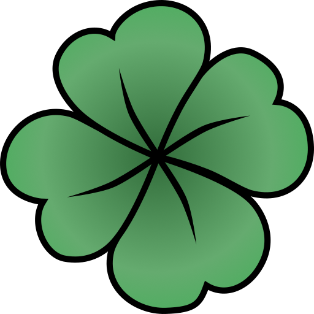

  <a href="https://">
    <picture>
      
    </picture>
    <h1 align="center">picori</h1>
  </a>

Picori is a library for building modding tools and decompliation tools for
GameCube and Wii games. It includes support for encoding and decoding many
of Nintendos file formats, common compression algorithms, non-english string
encodings and the ability to demangle C++ symbols.

## Formats

Picori supports the following formats:

- [DOL - Dolphin Executable][`format::dol`]
- [REL - Relocatable Executable][`format::rel`]
- [GCM - GameCube Master Disc][`format::gcm`]
- [RARC - Nintendo RARC][`format::rarc`]
- [CISO - Compact ISO (WIB)][`format::ciso`]
- [ELF - Executable and Linkable Format][`format::elf`][^note-elf]

In the future adding support for more formats is planned.

[^note-elf]: ELF is not a specific format used by either GameCube or Wii,
but no known compiler outputs DOL files direct (and for good reasons),
instead they produce ELF files. Support for   ELF (specific to GameCube and
Wii) are useful.

## Compression

Picori supports the following compression algorithms:

- [Yaz0][`compression::yaz0`]
- [Yay0][`compression::yaz0`]

## C++ Demangler

Picori also includes a [C++ demangler][`demangle::mwcc`] for MWCC (Metrowerks CodeWarrior
Compiler) that was probably include and shipped with the SDK and used for
GameCube development.

## Examples

TODO: Add examples

License: MIT
